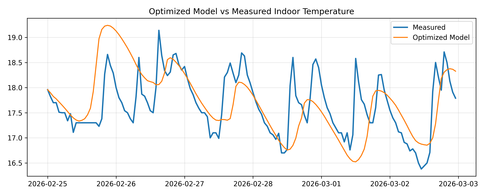

# Residential Thermal Digital Twin
### Data-Driven & Physics-Informed Modeling of a Real Apartment

A data-driven and physics-informed thermal model of a real apartment, combining sensor data with first-order dynamics.

The project demonstrates how simple models, when properly calibrated, can provide accurate short-term thermal predictions and 
support future control-oriented applications.

## Key Results

- Achieved ~0.41°C MAE in indoor temperature prediction
- Developed a first-order thermal simulator with dynamic solar proxy
- Validated model consistency using both empirical and optimization-based parameter estimation
- Demonstrated stable parameter convergence and physical plausibility

## Project Overview

This project develops a simplified thermal digital twin of a residential space using real sensor data.

The approach combines:
- empirical analysis of thermal behavior
- first-order physical modeling
- data-driven parameter optimization

The goal is to create a model that is:
- interpretable
- computationally simple
- sufficiently accurate for short-term prediction and control applications


## System Setup

The dataset is collected from a real apartment equipped with:

- indoor temperature sensors
- outdoor sensors (north and south exposure)

Data is recorded through a Home Assistant setup and processed using Python.

## Methodology

The project is structured in four main steps:

1. **Data Exploration**
   - sensor validation
   - temperature trends analysis

2. **Heat Loss Estimation**
   - cooling slope analysis
   - estimation of thermal loss coefficient (k)

3. **Thermal Simulation**
   - development of a first-order model
   - introduction of a dynamic solar proxy

4. **Parameter Optimization**
   - calibration using full time series
   - comparison with empirical estimates
   
## Thermal Model

The final model is based on a first-order energy balance:

T(t+1) = T(t) + [-k · (T(t) - T_out) + α · solar_proxy] · Δt

Where:
- k represents heat loss to the environment
- α scales solar gains
- the solar proxy is derived from the temperature difference between south- and north-facing outdoor sensors

## Results

The optimized model reproduces indoor temperature dynamics with good short-term accuracy:



## Key Insights

- A simple first-order model can capture dominant thermal dynamics
- Dynamic solar proxy significantly improves performance
- Empirical and optimized parameters remain consistent
- Model complexity beyond this level does not necessarily improve accuracy
- Identified consistent thermal parameters across empirical and optimization-based approaches
- Optimization refines but does not contradict empirical parameter estimates

## Practical Implications

The calibrated model provides more than just temperature prediction — it enables a first quantitative assessment of the 
building’s thermal performance.

Using the estimated parameters, it becomes possible to:

- identify areas with higher effective heat losses
- compare thermal behavior across zones
- assess the potential impact of targeted interventions

Although the model is simplified, it offers a data-driven basis for prioritizing energy efficiency improvements and 
moving towards more informed, performance-oriented decision making.

## Limitations

- The model does not explicitly account for:
  - internal gains
  - occupancy patterns
  - HVAC operation
- Parameters act as effective quantities rather than directly measurable physical constants
- Accuracy is limited for long-term predictions or highly dynamic conditions

## Future Work

- Integration with control strategies (e.g., MPC)
- Extension to multi-zone modeling
- Incorporation of additional sensors (humidity, power consumption)
- Exploration of hybrid physics + ML approaches (e.g., PINNs)
- Integration of HVAC runtime / energy measurements

## Repository Structure

- `data/`: raw, processed and sample datasets
- `notebooks/`: exploratory and modeling notebooks
- `reports/figures/`: generated plots and visual outputs

## Current Status

- [x] multi-point temperature monitoring
- [x] initial heat loss estimation
- [x] thermal coefficient estimation
- [x] validated thermal simulator
- [ ] PINN-based modeling feasibility study

1. Install dependencies:
   ```bash
   pip install -r requirements.txt```
2. Open the notebooks in order:
- 01_data_exploration.ipynb
- 02_ua_estimation.ipynb
- 03_thermal_simulator.ipynb
- 04_parameter_optimization.ipynb

## Notes

This repository is a curated public version of an ongoing residential thermal modeling project.
It is intended as a technical artifact, not as a complete production system.
